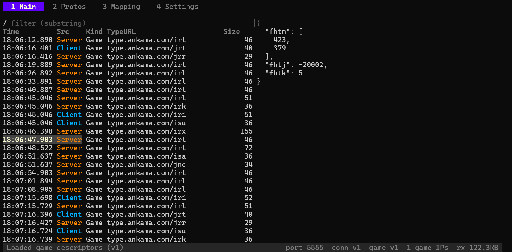

# Dofus 3 Sniffer TUI

A Dofus 3 protobuf message sniffer using gopacket & BubbleTea, 100% made by Claude in ~1.5 hour

Works on Windows 11, hasn't been tested on Mac/Linux.



## Requirements

- Go
- [Npcap](https://npcap.com/)

## Installation

```bash
git clone https://github.com/tikkamasala/dofus3-sniffer-tui.git
cd dofus3-sniffer-tui
go build -o sniffer.exe ./cmd/sniffer/main.go
```

## Usage

- Start `sniffer.exe`, you should be in the `Settings` tab
- Select your network interface
- `Server port` and `Connection server` should be correct unless you have changed the game connection port in Ankama Launcher
- Hit `2` to go to `Protos` tab
- `i` to add the protobuf file path extracted from `Ankama.Dofus.Protocol.Connection` assembly
- `e` to set the envelope message.
- `s` to switch to the `Game` tab and set the protobuf file path from `Ankama.Dofus.Protocol.Game` assembly
- For `3.5.11.14` : connection envelope = `leo`, game envelope = `gui`

- Start the game and voilà, you should see the protobuf messages between the client and the server

## Mapping file format

The sniffer supports a `Mapping` JSON file to rename the obfuscated messages and fields names

You can edit the file and the sniffer will hot reload it

```json
{
    "type.ankama.com/iri": "MapMovementRequest",
    "type.ankama.com/irl": {
        "name": "MapMovementEvent",
        "fields": {
            "fhtj": "actor_id"
        }
    }
}
```

## Limitations

I haven't figured out yet why the sniffer does not work if you start it after the game, I handled that case on my old sniffer but didn't want to spend more time troubleshooting on this one.

There may be a bug where some packets are missed, haven't troubleshooted that one either.